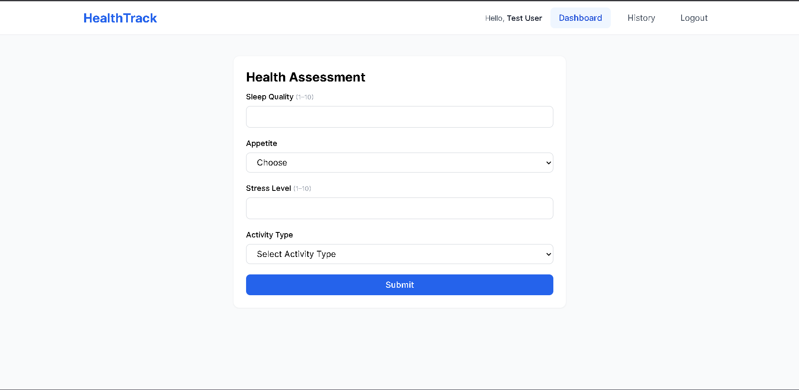
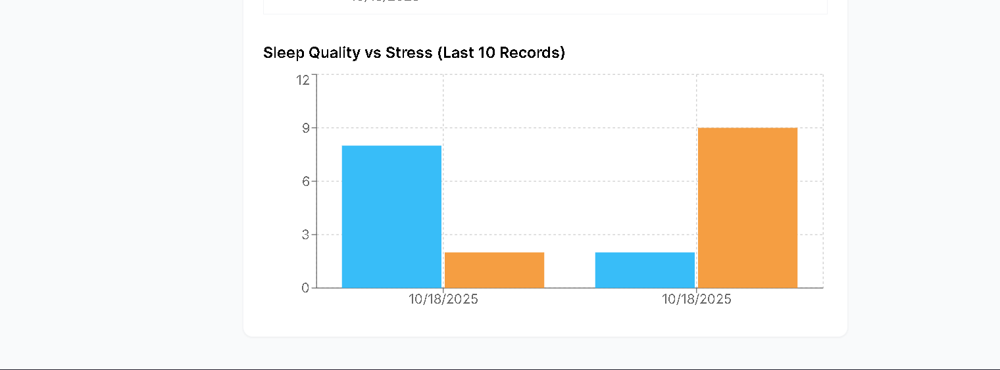

# HealthTrack - Mini Healthcare Platform

## Overview

HealthTrack is a simplified healthcare web application built with the MERN stack. Users can sign up, log in, fill out a health assessment form, and view AI-generated health results as well as their past health history with visual charts.

---

## Tech Stack

- **Frontend:** React 18 + Vite, Tailwind CSS 3, React Router v6, Axios, Recharts  
- **Backend:** Node.js with Express, MongoDB with Mongoose, JWT authentication, bcrypt for password hashing  
- **Database:** MongoDB Atlas (cloud)  
- **Deployment:** Frontend on Vercel, Backend on Render

---

## Setup Instructions

1. **Clone the repository:**

```
git clone https://github.com/rajanarahul93/healthtrack.git
cd healthtrack
```

2. **Backend setup:**

```
cd backend
npm install
```

Create a `.env` file in the `backend` folder with the following variables:

```
PORT=5000
NODE_ENV=development
MONGO_URI=your_mongodb_atlas_connection_string
JWT_SECRET=your_jwt_secret_key
CLIENT_URL=http://localhost:5173
```

3. **Frontend setup:**

```
cd ../frontend
npm install
```

Create a `.env` file in the `frontend` folder containing:

```
VITE_API_URL=http://localhost:5000/api
```

4. **Run backend server locally:**

```
cd ../backend
npm run dev
```

5. **Run frontend server locally:**

```
cd ../frontend
npm run dev
```

6. **Open your browser and navigate to:**

```
http://localhost:5173
```

---

## Screenshots

  


*Or watch the demo:* [Demo Link](https://screenapp.io/app/v/1uCu9zZCDm)

---

## Brief Explanation of Dosha Result Logic (Mock AI)

The health analysis feature uses a simple heuristic to simulate AI-generated insights based on user input:

- **High stress detected:** Sleep quality below 4 combined with stress level above 7. Recommendation encourages relaxation and sufficient sleep (7+ hours).  
- **Unbalanced:** Appetite is "Poor" or sleep quality below 5. Recommends improving sleep and diet habits.  
- **Mild stress detected:** Activity type is "Sedentary" and stress level above 6. Suggests increasing daily physical activity.  
- **Balanced:** Default status when none of the above apply, encouraging maintenance of healthy routines.

This logic provides users with personalized, mock health feedback based on their assessment data.